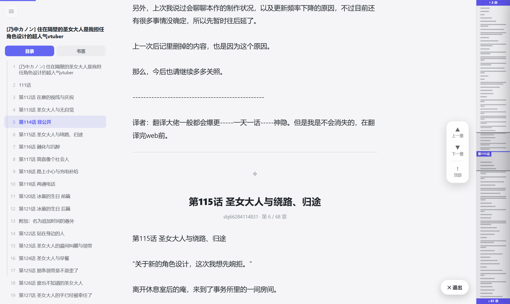
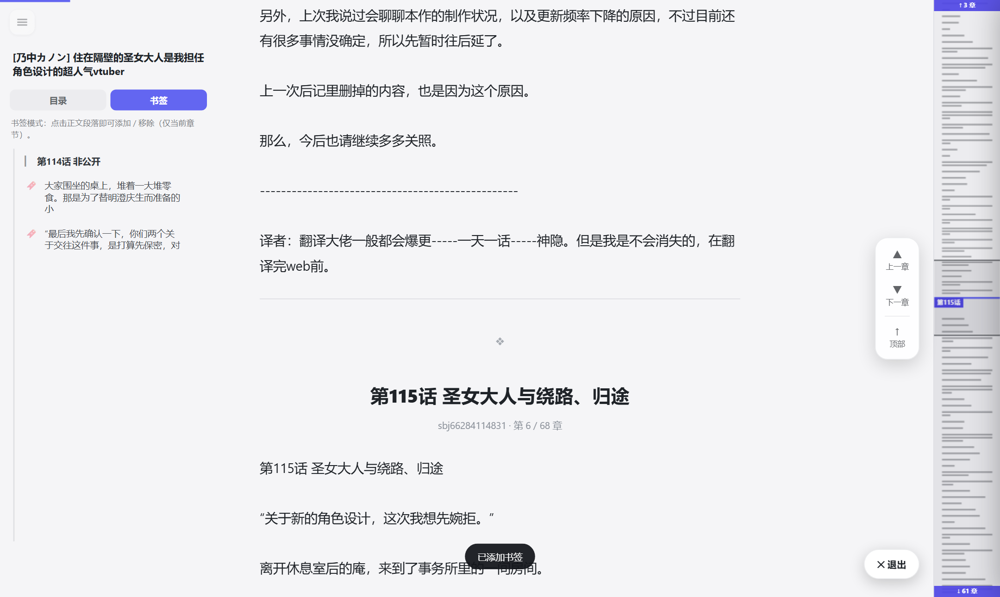
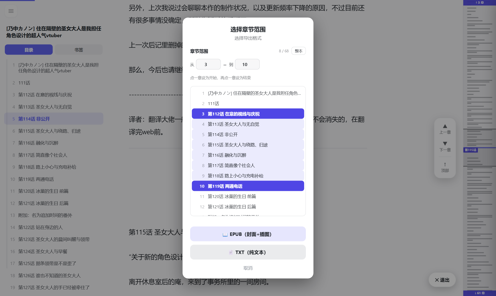
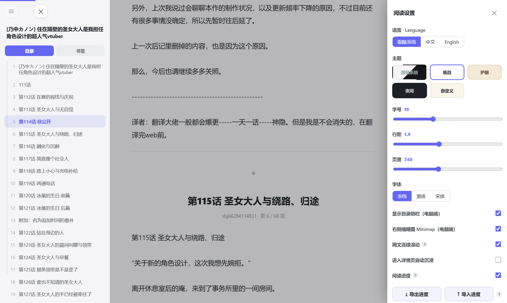

English · [简体中文](README.md)

# 轻读 · LightNovel Immersive Reader

A single-file **Tampermonkey / Violentmonkey userscript** that injects a clean, Google-Docs-style **immersive reader** into the live [www.lightnovel.fun](https://www.lightnovel.fun) — *without* replacing the site. It reads the site's own web API same-origin, renders chapters in a distraction-free Shadow-DOM overlay, remembers where you stopped, and can export a book as EPUB/TXT or push it straight into your **Calibre** library with real metadata.

> 📥 **One-click install**: install [Tampermonkey](https://www.tampermonkey.net/) or [Violentmonkey](https://violentmonkey.github.io/), then click **[📖 Install](https://raw.githubusercontent.com/Catkamakura/lightnovel-immersive-reader/main/lightnovel-immersive-reader.user.js)** — your browser jumps straight to the userscript manager's install page.
> (The link only works when the repo is **public**: `raw` links for a private repo need a temporary token and can't install directly.)

## Features

- **Seamless continuous scroll for web novels** *(new in v2.0)* — read straight through the book: scrolling past a chapter's end flows into the next chapter, scrolling up flows into the previous one, Qidian-style. Chapters are **prefetched in the background** so the boundary never waits on the network, bodies render in **lazy chunks** (offscreen text costs no layout/paint), and a wide **❖ divider** makes every chapter boundary unmistakable. A floating chip shows `chapter · 第 i / N 章 · ~book%`. Prefer pages? One settings toggle (**网文连续滚动**) returns to the classic one-chapter-per-page reader.
- **Immersive reader overlay** — paper/sepia/green/dark themes, adjustable font, size, line-height, page width; nothing on the real page is modified.
- **Left outline** (类 Google Docs) — jump to any section or chapter.
- **Auto + manual chapterization** — long single articles are auto-split into sections; you can also split/merge chapters by hand.
- **Per-chapter bookmarks**, grouped by chapter in the outline.
- **Sublime-style minimap** — a code-editor-style page map with **click-to-jump**. In seamless mode it maps the loaded chapter window in detail, with pinned **↑ / ↓ caps** showing how many chapters lie beyond — click a cap to jump there; the native scrollbar remains the whole-book position.
- **Themes** — built-ins plus **follow-system** (auto light/dark) and a **custom hex** background color.
- **UI language** — **English / 中文**, defaults to your system language, switchable in settings.
- **Resume reading** — web novels resume at the last-read **chapter** from LightNovel's *own* history (plus the within-chapter position in seamless mode); single-article books resume at the last **scroll position** from local memory. Progress is account-scoped and **export / import**able.
- **Export** — one-click **EPUB** (with cover + embedded images) or **TXT**, with a selectable **chapter range**. **EPUB3 by default** (current standard) with an **EPUB2 fallback** for older devices/readers — see below.
- **Send to Calibre** — POST the exact EPUB you read to the optional [`calibre-bridge`](calibre-bridge/) companion, which drops it into a Calibre-Web-Automated library. *(experimental — see below.)*
- **Metadata** — a rule-based credit parser (作者 / 插画 / 翻译 / 图源 / 录入, simplified + traditional) plus an **optional LLM path** (OpenAI-compatible / DeepSeek / Kimi) that reads only the short 卷首 credit block and is cached per book. *(experimental — see below.)*
- **Step-by-step feature guide (功能向导)** — 11 steps that walk through both the reader and the settings (theme, EPUB version, resume, the experimental folds). The spotlight is positioned after the panel/scroll settles so it matches the element's real position, and the reader is non-interactive during the guide so you can't mis-click.

## Highlights

**Seamless scroll** — chapters flow into each other with a clear ❖ divider; the outline tracks the chapter you're in and the minimap (right) maps the loaded window with ↑/↓ caps:



**Bookmarks** — switch to the 书签 tab and click any paragraph; marks show inline, in the outline, and as amber ticks on the minimap:



**Download with a chapter range** — pick a start and an end chapter (or type numbers), then export EPUB/TXT:



**Settings** — theme/font/width, minimap, seamless scroll, resume, EPUB version, and the experimental integrations:



## Video demo

A narrated walkthrough (with on-screen guides and bilingual subtitles) lives in the repo:

- 🎬 **[Demo — Chinese narration](docs/assets/demo-zh.mp4)** · **[English narration](docs/assets/demo-en.mp4)** (中文/English subtitles in both)

## EPUB output

The reader builds a real **EPUB3 by default** (the current standard) — verified **epubcheck-clean (0 errors)**:

- MARC relator roles via `<meta refines property="role" scheme="marc:relators">`
- series via `belongs-to-collection` (plus `calibre:series` for Calibre)
- a proper XHTML Navigation Document (`<nav epub:type="toc">`, manifest `properties="nav"`)
- `dcterms:modified` release identifier and a cover marked `properties="cover-image"`

An **EPUB2 fallback** is available for older devices/readers (settings → **下载 EPUB 版本**, setting key `epubVer`: `3` default, `2`). Images that can't be embedded are dropped so the EPUB is always self-contained, and LightNovel's custom `img-width` / `img-height` attributes are stripped. The optional bridge's `enrich_epub` is **version-aware**: it writes refines for EPUB3 (cleaning any dangling refines and refreshing `dcterms:modified`) and `opf:role` attributes for EPUB2.

## Install

1. Install a userscript manager: **[Tampermonkey](https://www.tampermonkey.net/)** or **[Violentmonkey](https://violentmonkey.github.io/)**.
2. Install the script: click **[📖 Install](https://raw.githubusercontent.com/Catkamakura/lightnovel-immersive-reader/main/lightnovel-immersive-reader.user.js)** (the raw `.user.js` link above) and your manager pops up its install page — or copy the contents of [`lightnovel-immersive-reader.user.js`](lightnovel-immersive-reader.user.js) into a new userscript.
3. Open any page on `https://www.lightnovel.fun/` — the reader is now available.

It only requests `GM_xmlhttpRequest` and `@connect`s to `lightnovel.fun`, `127.0.0.1` / `localhost` (the optional bridge), and your chosen LLM host (DeepSeek / Kimi / OpenAI / Moonshot). No secrets are baked in — API keys and the bridge token are entered at runtime in the reader's settings.

## Quick use

- On a **detail or list page**, click the **📖 沉浸阅读** button to open the immersive reader (list pages get a small **📖** on each card).
- Hover the **top-left corner menu** to reveal the controls:
  - **☰** — outline / table of contents
  - **⤓** — download the whole book (EPUB / TXT, with chapter range); appears only for books long enough to be worth exporting
  - **⚙** — reading settings (theme, font, size, line-height, width, minimap, resume, EPUB version, library, LLM) and the step-by-step **功能向导**
- Click the **✕ 退出** pill (bottom-right) or press **Esc** to leave. On exit the underlying site navigates to the chapter you were reading, so the page behind matches.

## Experimental / at your own risk

Two parts of the project are **experimental** and connect to **external services** — use them at your own risk:

- **calibre-bridge integration** — the **发送到书库 (Calibre)** setting (collapsed by default, tagged 实验性) and the cross-origin `@connect` to the local bridge (`127.0.0.1` / `localhost`).
- **LLM metadata** — the **LLM 整理元数据** setting (collapsed by default, tagged 实验性) and the cross-origin `@connect` to LLM hosts (`api.deepseek.com` / `api.kimi.com` / `api.openai.com` / `api.moonshot.cn`). This may **incur cost**.

In both cases your **API keys / bridge token are stored in the browser's localStorage**. Understand what you're enabling before turning these on.

## Optional: send to your Calibre library

> **Experimental** — see the note above.

The reader can POST the EPUB you just read into a **Calibre-Web-Automated (CWA)** library via the [`calibre-bridge/`](calibre-bridge/) FastAPI companion, which enriches the EPUB's OPF metadata (title, author, translator, series + volume, identifiers, cover, tags) and drops it into CWA's ingest folder. **Import only** — no progress/bookmark sync.

```bash
cd calibre-bridge
cp .env.example .env          # optional: set a BRIDGE_TOKEN
docker compose up -d --build
```

This scaffolds both CWA (web UI at `http://localhost:8083`) and the bridge (`http://127.0.0.1:8788`). Then in the reader open **设置 → 发送到书库** (an experimental, collapsed-by-default section), tick *启用书库*, leave the URL as `http://127.0.0.1:8788`, and (optionally) paste your token. The download dialog now shows a **📚 发送到书库** button. See [`calibre-bridge/README.md`](calibre-bridge/README.md) for remote/Tailscale setups, the `calibredb` mode, and the API.

## Repository layout

```
lightnovel-immersive-reader-repo/
├── lightnovel-immersive-reader.user.js   # the userscript (single-file, vanilla JS IIFE)
├── package.json                          # verify scripts (Playwright)
├── LICENSE                               # MIT
├── calibre-bridge/                       # optional FastAPI companion (Python / uv / Docker)
│   ├── bridge/                           # main.py, epub_meta.py, calibre.py, store.py, config.py
│   ├── tests/                            # pytest suite
│   ├── docker-compose.yml                # CWA + bridge
│   ├── Dockerfile
│   ├── pyproject.toml
│   └── README.md
├── verify/                               # headless verification scripts
│   ├── verify-userscript.mjs
│   ├── verify-webnovel.mjs
│   └── verify-lib.mjs
├── docs/                                 # the wiki (see below)
├── AGENTS.md                             # orientation for AI coding agents
└── CLAUDE.md                             # → points at AGENTS.md
```

## Docs

Start here if you're an LLM agent: **[`AGENTS.md`](AGENTS.md)** (project map, commands, conventions, gotchas).

The wiki under [`docs/`](docs/):

- [`docs/architecture.md`](docs/architecture.md) — how the userscript, the site API, and the bridge fit together; where all state lives; the two reader modes.
- [`docs/userscript.md`](docs/userscript.md) — developer/LLM reference for the userscript: the `S` state, API helpers, chapterization, rendering, navigation, minimap, bookmarks, resume, settings.
- [`docs/metadata.md`](docs/metadata.md) — the metadata pipeline and the EPUB OPF credit mapping (rule-based + optional LLM, MARC relator roles, tag fallbacks).
- [`docs/lk-web-api.md`](docs/lk-web-api.md) — the lightnovel.fun web API as consumed here (envelope, endpoints, the reading model, the "no within-article progress" finding).
- [`docs/calibre-bridge.md`](docs/calibre-bridge.md) — the bridge: endpoints, modes, running locally / in Docker, deployment, tests.
- [`docs/development.md`](docs/development.md) — how to develop and verify; conventions and gotchas.
- [`calibre-bridge/README.md`](calibre-bridge/README.md) — the bridge's own quick start + remote/Tailscale setup.

## Develop / verify

The reader is a single vanilla-JS file with no build step. Verification runs headless via Playwright:

```bash
npx playwright install chromium    # one-time: install the browser
npm run verify                     # verify-userscript.mjs
npm run verify:webnovel            # web-novel (series) mode
npm run verify:lib                 # send-to-library path
```

The bridge has its own Python tests (`uv run pytest` inside `calibre-bridge/`).

## License

[MIT](LICENSE) © masiro
